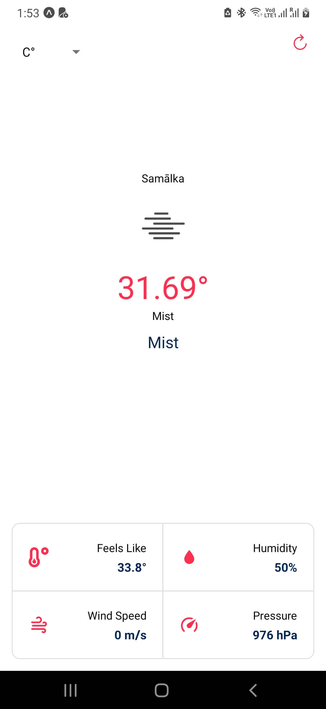
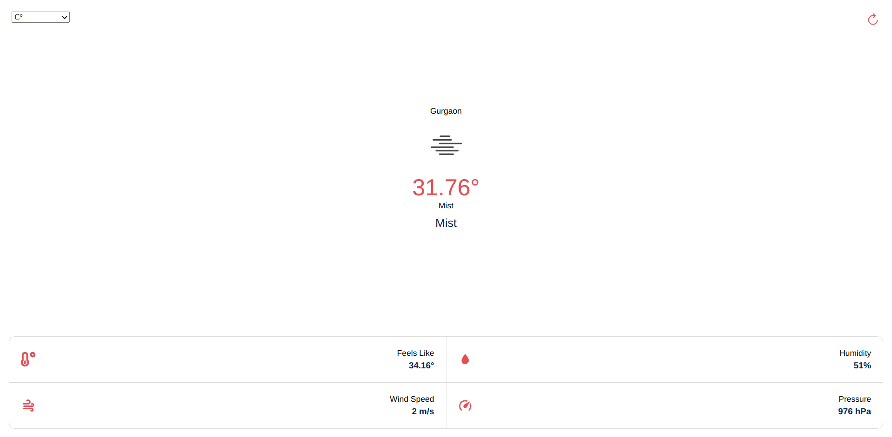

# Weather App - React Native
Single-screen weather app built with React Native. Requests location permission and show current weather details.

## Samples
<a href="./samples/list.png">
  
</a>

<a href="./samples/landing.png">
  
</a>

## Get Started

Install the dependencies

```bash
yarn install
```

Run the dev build

```bash
yarn start
```
Use **Expo interface** to launch on different platforms 

## Technologies Used
- [React Native](https://reactnative.dev/)
- [Expo](https://expo.io/)
- [Dotenv](https://www.npmjs.com/package/react-native-dotenv)
  
## Features
- Lightweight
- Easy-to-use
- Current weather
- Change units: Celsius or Fahrenheit

## Credits
- **Esteban Codes** Tutorial: https://youtu.be/NgDaPmxewcg
- Weather API: http://openweathermap.org/